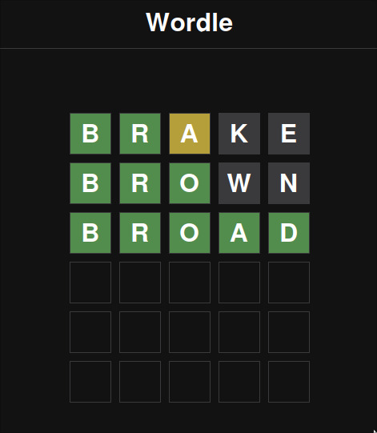

# 30 Days of JavaScript - Project 6: Wordle Clone

A Wordle game clone built using HTML, CSS, and JavaScript. Guess the hidden word within six attempts!

## Project Overview

In this project, I created a Wordle game clone as part of the "30 Days of JavaScript" challenge. The goal is to guess a hidden word within six attempts. You can enter letters, and the game will provide feedback to help you deduce the correct word.

## Features

- Interactive gameplay with a limited number of attempts.
- Real-time feedback on your guessed letters.
- Randomly selected hidden words for each game.

## How to Play

1. Open the `index.html` file in your web browser.
2. Start guessing letters to find the hidden word.
3. Enter a letter by typing it on your keyboard.
4. Press the "Enter" key to submit your guess.
5. Green cells indicate correct letters in the correct positions.
6. Yellow cells indicate correct letters in the wrong positions.
7. Gray cells indicate incorrect letters.
8. You have six attempts to guess the word correctly.

## Technologies Used

- HTML
- CSS
- JavaScript

## Word List

The game uses a word list with over 3,000 words.

## Acknowledgments

- This project is part of the "30 Days of JavaScript" challenge.
- Word list source: [5 Letter Words - Byjus](https://byjus.com/english/5-letter-words/)

## Author

Pratik Hande

## License

This project is open source and available under the [MIT License](LICENSE).
